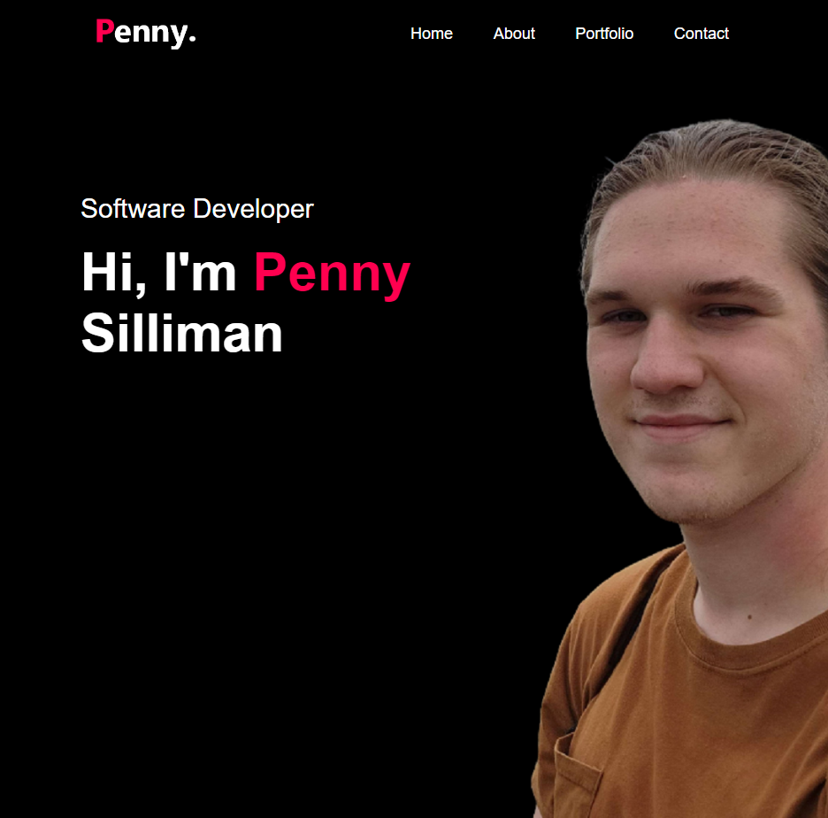

# Name of Project

## Table of Contents

- [Name of Project](#name-of-project)
  - [Table of Contents](#table-of-contents)
  - [Overview](#overview)
    - [Built With](#built-with)
  - [Features](#features)
  - [Acknowledgements](#acknowledgements)

## Overview

See <!-- create a demo video and insert link here --> for a live demo.

When I first embarked on this project, I expected it to be a quick and straightforward endeavor, merely a means to showcase my work in a user-friendly manner. My approach was to follow a tutorial I found on YouTube (for more details, please refer to the Features section in the README). Initially, I leaned heavily on this tutorial due to my limited interest in front-end web design, as my expertise primarily lies in back-end and software development. However, to my surprise, this project turned out to be a significant learning experience.

During this project, I delved into the world of CSS transformations and time transitions, skills I had not anticipated learning from this project. I was pretty amazed at the capabilities of such simple CSS code.

Moreover, this project introduced me to GitHub Pages and the concept of web product delivery. While I had created websites in the past, I had never published one online for public access. During this journey, I explored the limitations of free options offered by cloud providers like Azure, AWS, and Google Cloud. Ultimately, GitHub Pages proved to be the perfect fit for the scale of my website.

However, I encountered a hurdle when implementing the Contact-Me section of the page. GitHub Pages supports only static websites to prevent excessive resource demands. I stumbled upon another GitHub Pages website with a comment section. Curious about how they achieved this with a static page required for GitHub Pages, I inspected their page using browser developer tools (F12) and discovered that they employed a static HTML form linked to a off-site non-static API for form submissions. This ingenious workaround allowed me to receive contact submissions in my email without exposing my address; all while maintaining my static website on GitHub Pages. During my research on similar APIs, I came across Formspree, which turned out to be a simple and ideal choice for my project, offering a great free plan that perfectly matched my project's scale.

For other programmers contemplating projects that may require skills they haven't yet acquired, my advice is simple: dive in and give it a try. I not only gained new skills but also discovered valuable resources like GitHub Pages and Formspree that I can use in future projects! It's all about dedicating time and being open to seeking help and learning from it.

### Built With
HTML, CSS, and JavaScript.
Contact form handled by:
Formspree
see https://formspree.io/ for more info on FormSpree

## Features
Provides a comprehensive list of Penny Silliman's Academic, Work, and Project Experience within the field of Computer Science.
Website contains icons and hyperlinks directing to live-demos, other socials, and Penny Silliman's resume download
This page also features a Contact-Me section to message Penny Silliman directly.

## Acknowledgements
This website was created using the tutorial:
"How TO Make A Portfolio Website Using HTML CSS JS | Complete Website Design"
by GreatStack on Youtube.com
Link to video:
https://www.youtube.com/watch?v=0YFrGy_mzjY